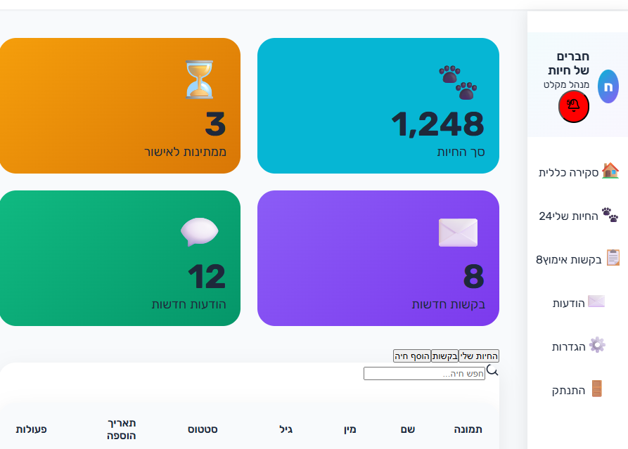
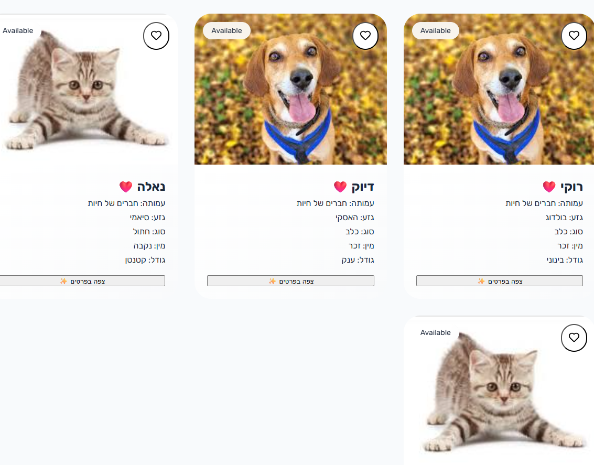

# Pet-Net – מערכת אימוץ חיות חכמה ומתקדמת (פרויקט אישי Full-Stack)



> דשבורד מנהלים עם סטטיסטיקות בזמן אמת, התראות והודעות

**בניתי לבד** מערכת end-to-end שלמה לניהול אימוץ חיות – מהחיפוש הציבורי ועד דשבורד מנהלים מלא עם עריכה ישירה של חיות.  
הכל בעברית מלאה, רספונסיבי למובייל, מאובטח עם JWT + הרשאות לפי תפקידים, ועם UI/UX ברמה של מוצר אמיתי.

## פיצ'רים מרכזיים

- חיפוש חיות מתקדם (מין, גודל, גזע, חיסונים, סטטוס)
- דשבורד מנהלים עם טבלה ניתנת לעריכה ישירה + שמירה אוטומטית
- דף אומנה רפואית עם סינון אוטומטי
- מערכת הרשאות: משתמש רגיל ← מנהל מקלט ← אדמין
- טעינת נתוני בסיס חכמה (cache ב-localStorage + Redux)

## צילומי מסך


> דף הבית הציבורי – חיפוש, כרטיסי חיות וקריאה לפעולה



> כרטיסי חיות עם תמונות, סטטוס ומידע מפורט

## Tech Stack & What I Built

| Category         | Technologies                                      | What I Built                                                  |
| ---------------- | ------------------------------------------------- | ------------------------------------------------------------- |
| **Frontend**     | React 18 + TypeScript + Redux Toolkit + RTK Query | Custom hooks, async thunks, global state, reusable components |
| **Backend**      | Node.js + Express + TypeScript                    | Full REST API, JWT auth, role-based middleware                |
| **Database**     | MySQL (mysql2)                                    | Full schema, complex JOIN queries, seed data                  |
| **Styling & UX** | Tailwind CSS + Lucide Icons + Sonner Toast        | Fully RTL Hebrew design, responsive, animations               |
| **Forms**        | React Hook Form                                   | Real-time validation, multi-step forms                        |
| **State**        | Redux Persist + localStorage                      | Offline-first caching of reference data                       |
| **Tools**        | Vite + ESLint + Prettier + Git                    | Clean architecture & conventional commits                     |

## איך להריץ

```bash
# Frontend
cd frontend && npm install && npm run dev

# Backend
cd backend && npm install && npm run dev
```

## 👩‍💻 מחפשת את המשרת הראשונה שלי כ-Junior / Mid Full-Stack Developer

אם הפרויקט עשה לך וואו – אני ממש אשמח לדבר!  
אני זמינה לראיונות, Take-Home assignments, או סתם שיחה על קפה + כלבים 🐶☕

**שירלי שוורץ**  
📧 shirly.sch15@gmail.com  
🔗 [linkedin.com/in/shirlyschwartz](www.linkedin.com/in/shirly-schwartz-0865b4180)  
📱 053-7611175

> "בנוי באהבה, בלילות ארוכים ובטונות של קפה – במיוחד בשביל החברים על ארבע"  
> **שירלי ⋅ דצמבר 2025**
